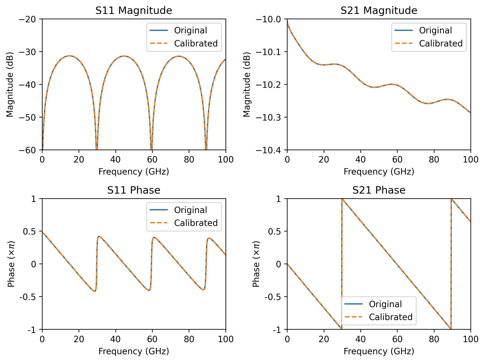

# Line-Reflect-Match (LRM) Calibration

This code implements LRM (Line-Reflect-Match) calibration (there are bunch of literature out there). The implementation here follows my interpretation of the method with constraints similar to those used in TRL calibration. The key concept is treating the match standard as an infinite transmission line with losses.

Key constraints:
- The match standard must be symmetric with zero reflection
- The line/thru (if non-zero length) must have same impedance as match, hence, zero reflection
- The reflect standard is unknown but must be symmetric (an estimate required)

Unlike TRL calibration, LRM does not provide the propagation constant as a byproduct. Therefore, you need to know this constant in advance when defining your line (if non-zero length). You can perform impedance renormalization after completing the calibration.

If you want a more general procedure, consider checking the [LRM implementation in scikit-rf](https://scikit-rf.readthedocs.io/en/latest/api/calibration/generated/skrf.calibration.calibration.LRM.html).

## Code requirements

You need to have [`numpy`][numpy] and [`scikit-rf`][skrf] installed in your Python environment. To install these packages, run the following command:

```powershell
python -m pip install numpy scikit-rf -U
```

## How to use

Below is a sample code on how to run the LRM calibration:

```python
# lrm.py must also be in same folder.
from lrm import LRM
import skrf as rf

# Measured calibration standards
line_meas    = rf.Network('measured_line.s2p')
match_meas   = rf.Network('measured_match.s2p')
reflect_meas = rf.Network('measured_reflect.s2p')

reflect_est = -1  # e.g., short
gamma_length = 0 # you need to know this for non-zero length (e.g., from TRL or simulation)

# Measured switch terms
gamma_f = rf.Network('switch_f.s1p')
gamma_r = rf.Network('switch_r.s1p')

# Define the calibration and run it
cal = LRM(line=line_meas, match=match_meas, reflect=reflect_meas, 
            reflect_est=reflect_est, gamma_length=gamma_length,
            switch_term=[gamma_f, gamma_r])
cal.run()

dut = rf.Network('measured_dut.s2p')
cal_dut = cal.apply_cal(dut) # apply cal to the dut
```

## Renormalizing impedance

By default, the reference impedance after LRM calibration is set to the match standard's impedance. You can renormalize the calibration coefficients to any desired reference impedance by specifying both the match standard's impedance and your target impedance:

```python
# impedances can be frequency-dependent.
cal.renorm_impedance(new_impedance, old_impedance)
# the DUT is now calibrated with the new impedance.
cal_dut = cal.apply_cal(dut)
```

## Extracting Error Terms

The `error_coef()` method returns all 12 error terms of the calibration. These terms are automatically updated when you perform impedance renormalization. Below are the available error terms:

```python
# forward direction
cal.coefs['EDF'] # forward directivity
cal.coefs['ESF'] # forward source match
cal.coefs['ERF'] # forward reflection tracking
cal.coefs['ELF'] # forward load match
cal.coefs['ETF'] # forward transmission tracking
cal.coefs['EXF'] # forward crosstalk (set to zero!)
cal.coefs['GF']  # forward switch term

# reverse direction
cal.coefs['EDR'] # reverse directivity
cal.coefs['ESR'] # reverse source match
cal.coefs['ERR'] # reverse reflection tracking
cal.coefs['ELR'] # reverse load match
cal.coefs['ETR'] # reverse transmission tracking
cal.coefs['EXR'] # reverse crosstalk (set to zero!)
cal.coefs['GR']  # reverse switch term
```

## Splitting reciprocal error-boxes

For error-boxes with reciprocal behavior (where S21 = S12), you can split them into left and right error-boxes using:

```python
left_ntwk, right_ntwk = cal.reciprocal_ntwk()
```

Note: Reciprocity typically applies to passive components like connectors. It does not apply to active devices (amplifiers) or components with diodes or ferromagnetic materials.

## Omitting reflect measurement

If you only need to measure the S21 parameter of your DUT, you can skip the reflect standard. The calibration can be performed using just the line/thru and match standards. Simply omit the `reflect` parameter or set it to `None`:

```Python
cal = LRM(line=thru_meas, match=match_meas)
```

## Code example

See the example file included. I probably have some measurements somewhere, but I'm too lazy to look for them. So, I did the second best thing, which is using simulated data 😉


_DUT S-parameters vs calibrated S-parameters_

## License

[](https://choosealicense.com/licenses/mit/)


[numpy]: https://github.com/numpy/numpy
[skrf]: https://github.com/scikit-rf/scikit-rf
